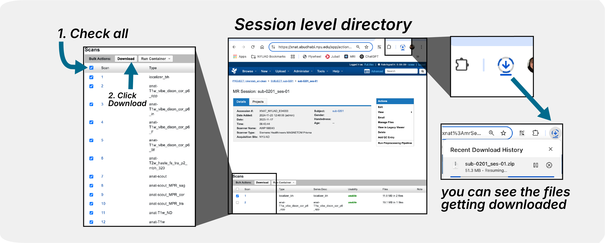

Download via Browser
====================

This guide covers how to download data directly from the XNAT web interface using your browser.

Overview
--------

The XNAT web interface provides a user-friendly way to browse and download data without requiring any programming knowledge. This method is ideal for:

- Small-scale data downloads
- Exploring data before bulk downloads
- One-off data retrieval tasks
- Users who prefer graphical interfaces

Getting Started
---------------

Accessing the Web Interface
~~~~~~~~~~~~~~~~~~~~~~~~~~~

https://xnat.abudhabi.nyu.edu/

Navigating to Your Data
~~~~~~~~~~~~~~~~~~~~~~~

Navigate through the XNAT interface to find your project and browse available subjects and sessions.

--------------------------------

Single File Download
~~~~~~~~~~~~~~~~~~~~

Click on individual files to download them one at a time directly through the browser.

--------------------------------

Session Download
~~~~~~~~~~~~~~~~

Use the session-level download options to get all scans from a single imaging session.

--------------------------------

Bulk Download
~~~~~~~~~~~~~

Access bulk download features to download multiple sessions or entire projects at once.

--------------------------------

Troubleshooting
---------------

Common Issues
~~~~~~~~~~~~~

- Large file timeout issues (this has been patched)
- Browser compatibility problems (needs to be tested)
- Network interruption (make sure you have a stable internet connection)

See Also
--------

- :doc:`python_scripts` - For programmatic downloads
- :doc:`desktop_client` - For desktop application downloads
- :doc:`../working_with_xnat/navigation` - For general XNAT navigation
