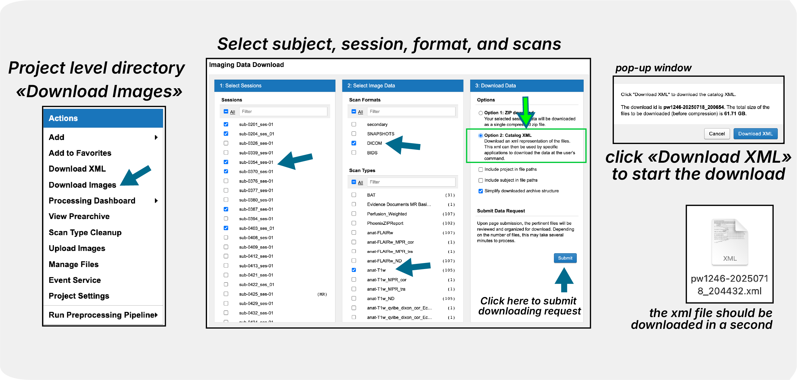
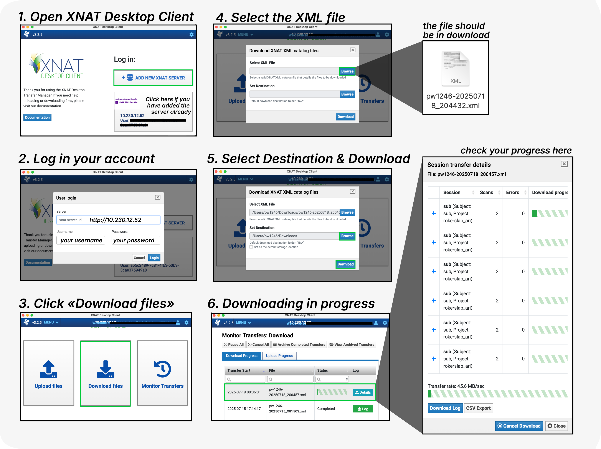

Download via Desktop Client
===========================

This guide covers using the XNAT Desktop Client for downloading data from XNAT. The Desktop Client provides the most reliable method for downloading large datasets with features like pause, resume, and background processing.

Prerequisites
-------------

- **XNAT Desktop Client installed** - see :doc:`../working_with_xnat/install_desktop_client`
- **Server connection configured** with your XNAT credentials
- **Network access** to xnat.abudhabi.nyu.edu

Generate XML file in XNAT
-------------------------

--------------------------------
  
   - Go to your project and select "Download Images"
   - Choose "Catalog XML" as the download format
   - Download the .xml file to your computer

Import to Desktop Client
------------------------

--------------------------------

   - Open XNAT Desktop Client
   - Ensure you're logged into the correct XNAT server
   - Select "Download Files" from the main menu
   - Browse and select your downloaded .xml file
   - Set download location and click "Download"

For comprehensive downloading instructions, see the `official download guide <https://wiki.xnat.org/xnat-tools/downloading-image-sessions>`_.

Troubleshooting
---------------

**Conflicting Sessions:**
- Issue: Download conflicts with existing Desktop Client session
- Solution: Ensure you're logged into the same XNAT server with the same credentials in both web browser and Desktop Client

**Slow Downloads:**
- Current speed limit: 10 MB/s. This is being worked on.
- Large datasets will take time - use pause/resume as needed
- Plan downloads during off-peak hours

**Failed Downloads:**
- Check network connectivity to xnat.abudhabi.nyu.edu
- Verify authentication credentials are current
- Use Transfer Monitor to identify specific failed files

**Download Location Issues:**
- Set a default download location in Application Settings
- Ensure sufficient disk space for large datasets
- Check folder permissions for write access

Getting Help
------------

**For Desktop Client specific issues:**

- Review the `official XNAT Desktop Client documentation <https://wiki.xnat.org/xnat-tools/xnat-desktop-client-dxm>`_
- Check `application settings guide <https://wiki.xnat.org/xnat-tools/xnat-desktop-client-dxm/application-settings>`_
- Consult `version compatibility matrix <https://wiki.xnat.org/xnat-tools/desktop-client-version-compatibility-matrix>`_

Next Steps
----------

After downloading your data:

1. **Organize locally** according to your analysis workflow
2. **Verify data integrity** by checking file counts and sizes
3. **Begin analysis** with your preferred tools

Related Documentation
---------------------

- :doc:`../working_with_xnat/install_desktop_client` - Installation guide
- :doc:`browser` - Web browser download method
- :doc:`python_scripts` - Programmatic download methods