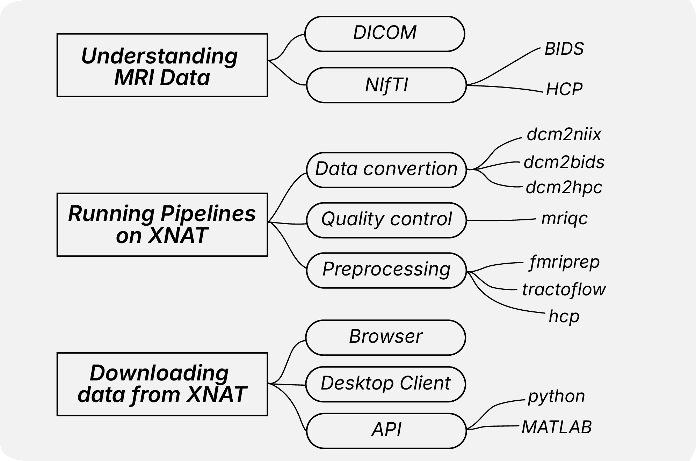

Getting Started with XNAT Documentation
=======================================

Welcome to the NYUAD XNAT User Documentation. This guide is designed to help you effectively use xnat with a focus on practical, hands-on workflows.

Documentation Structure
-----------------------

This documentation focuses on **three core activities** for effective MRI data management:

**1. Understanding MRI Data**
   Data formats and their relationships (DICOM → NIfTI → BIDS/HCP)

**2. Running Pipelines on XNAT**
   Available tools for data conversion, quality control, and preprocessing

**3. Downloading Data from XNAT**
   Multiple approaches: browser, desktop client, and automated scripts

**Additional Resources:**
This documentation also includes step‑by‑step guidance on account setup and platform navigation, best‑practice instructions for data uploads and project management, and a consolidated troubleshooting & FAQ section. Advanced users can also consult our dedicated guide on building and deploying custom pipelines within XNAT.

How to Use This Documentation
-----------------------------

**If you're new to XNAT:**

1. Start with :doc:`../working_with_xnat/access` to set up your account
2. Read :doc:`../understanding_data/overview` to understand data formats  
3. Browse :doc:`../processing_pipelines/overview` to see available tools
4. For general XNAT concepts, see the `official XNAT getting started guide <https://wiki.xnat.org/documentation/getting-started-with-xnat>`_

**If you're experienced:**

- Jump directly to the pipeline documentation for specific tools
- Use the download methods section for efficient data retrieval

