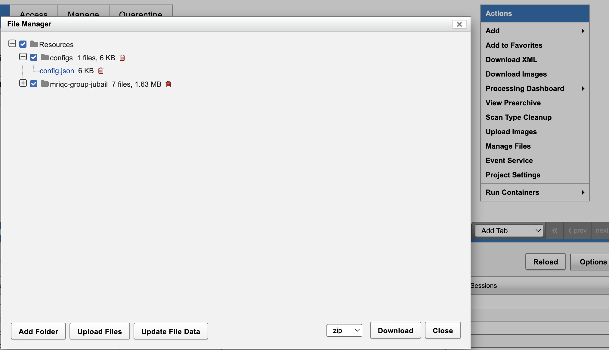

dcm2bids
========

The dcm2bids converts your DICOM data to BIDS format on XNAT. This is the **essential first step** that unlocks access to all modern analysis pipelines including :doc:`mriqc`, :doc:`fmriprep`, :doc:`tractoflow`, and others.

For comprehensive information about dcm2bids, visit the `official documentation <https://unfmontreal.github.io/Dcm2Bids/>`_.

What You Need
-------------

- DICOM data uploaded to your XNAT session
- Project permissions to run pipelines
- dcm2bids configuration file

How to Launch the Pipeline
--------------------------

.. note::
   For step-by-step instructions on running any pipeline, see :doc:`../working_with_xnat/running_pipelines`. To enable pipelines for your project, see :doc:`../working_with_xnat/enabling_pipelines`.

Navigate to your **session** in XNAT, click **"Run Pipeline"**, select **"dcm2bids"**, and configure these parameters:

- **Subject Number** (Optional): Leave this **empty** unless you want to use a different subject ID than the one derived from the DICOM. When left empty, the pipeline automatically extracts the subject number from the session label and zero-pads it to 4 digits (e.g. ``0201`` → ``sub-0201``).

  .. warning::

     Do not enter a subject number here unless you specifically need to override it. If you do enter a value, XNAT strips any leading zeros before passing it to the pipeline — so entering ``0201`` will produce ``sub-201`` instead of ``sub-0201``. To preserve the correct zero-padded ID, simply leave this field empty.

- **Session Number** (Optional): Override automatic session numbering
- **Enable Pydeface** (Default: True): Automatically deface anatomical images

**Automatic Features:**
- SBRef processing and fieldmap associations are handled automatically
- BIDS validation ensures compliant output

What You Get
------------

BIDS-formatted data in your session's **Resources/rawdata/** directory:

.. parsed-literal::

    **Resources/rawdata/**
      dataset_description.json
      participants.tsv
      **sub-<subject>/ses-<session>/**
        **anat/** → T1w, T2w images + JSON metadata
        **func/** → BOLD runs, SBRef images + JSON metadata  
        **fmap/** → Fieldmaps + JSON metadata (with IntendedFor configured)

For BIDS format details, see :doc:`../understanding_data/bids`.

Configuration Files (Advanced)
------------------------------

The dcm2bids configuration file tells dcm2bids how to map your study's DICOM series
into BIDS files. Because sequence names and scan protocols vary across projects, you
should create a ``config.json`` file tailored to your own study.

Upload the configuration file as a **project-level resource**:

1. Navigate to your project page in XNAT.
2. In the **Actions** panel, click **Manage Files**.
3. Under **Resources**, create a folder named ``configs`` if it does not already exist.
4. Upload your dcm2bids configuration file as ``config.json`` inside that folder.

The expected project resource path is:

.. code-block:: text

   Resources/configs/config.json

When the pipeline runs, it looks for this project-level ``config.json`` first. If it
cannot find a dcm2bids configuration file, it will try to use the default ARI
configuration maintained for NYUAD XNAT. That default is only a fallback. You should
always make your own configuration file for your study so sequence matching, task
labels, fieldmaps, SBRefs, and other BIDS metadata reflect your acquisition protocol.

For configuration file creation, see the `dcm2bids configuration guide <https://unfmontreal.github.io/Dcm2Bids/3.2.0/how-to/create-config-file/>`_.

Common Issues
-------------

**Non-Standard Sequence Names:** Create custom configuration file for site-specific protocols

**Missing Data:** Ensure all required sequences (T1w, functional) were acquired

**Privacy Settings:** Disable pydeface if needed using pipeline parameters

Next Steps
----------

1. **Quality Control**: Run :doc:`mriqc` to assess data quality  
2. **Preprocessing**: Use :doc:`fmriprep` for functional data processing
3. **Data Access**: Use :doc:`../data_download/browser` to download converted data

Related Documentation
---------------------

- :doc:`../understanding_data/bids` - Understanding BIDS format
- :doc:`mriqc` - Quality control after conversion
- :doc:`fmriprep` - fMRI preprocessing pipeline
