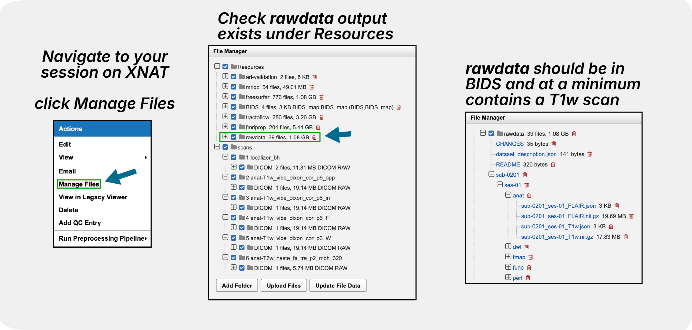
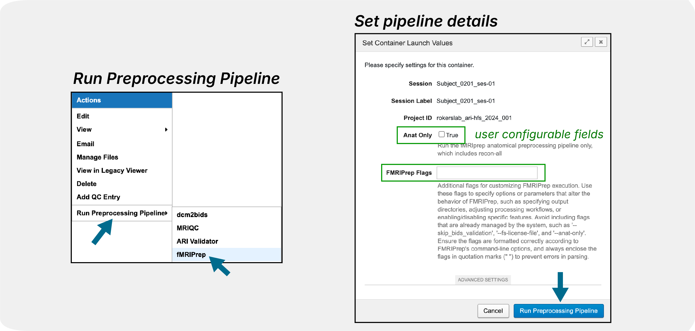

fMRIPrep
========

This page provides information on running the fMRIPrep pipeline via XNAT. 
We will explain **what fMRIPrep does**, show you **what you need to run fMRIPrep** and the exact steps to launch it, and help you understand some of the key **fMRIPrep outputs**. We will also talk about important **configuration options**, **common issues** to watch for, and how to **troubleshoot problems**. 

What is fMRIPrep?
-----------------

fMRIPrep is a robust and automated preprocessing pipeline for functional MRI data. It performs:

- **Anatomical Processing**: T1w/T2w image processing, brain extraction, and tissue segmentation
- **Functional Processing**: Motion correction, slice timing correction, and distortion correction
- **Surface-Based Processing**: FreeSurfer surface reconstruction and registration
- **Spatial Normalization**: Registration to standard spaces (MNI152, fsaverage)
- **Confound Estimation**: Comprehensive confound regression variables
- **Quality Control**: Automated quality assessment and visual reports

For detailed information about fMRIPrep, visit the `official documentation <https://fmriprep.org/en/stable/>`_.

What You Need Before Running
----------------------------
Before running fMRIPrep, you need to run :doc:`dcm2bids`, which will convert the raw data to BIDS format and output in the ``rawdata`` directory under ``Resources``.

Incorrect sbref and fieldmaps are some of the most common issues when running fMRIPrep. Please refer to the :doc:`dcm2bids` page for more details. If dcm2bids ran successfully, there's nothing else you need to do.

How to Launch the Pipeline
--------------------------
.. note::
   For step-by-step instructions on running any pipeline, see :doc:`../working_with_xnat/running_pipelines`. To enable pipelines for your project, see :doc:`../working_with_xnat/enabling_pipelines`. For running pipelines across multiple subjects in parallel, see :doc:`../working_with_xnat/parallel_processing`.

Navigate to your **session** on XNAT, click **"Run Preprocessing Pipeline"**, select **"fMRIPrep"** from the pipeline dropdown, and then configure the parameters below (see screenshot)

- **Anat Only**: Checkbox to run anatomical preprocessing only (freesurfer recon-all)
- **FMRIPrep Flags**: Text box for additional command-line options such as ``--output-spaces MNI152NLin2009cAsym:res-2``. For more information on the flags, see the `fMRIPrep documentation <https://fmriprep.org/en/stable/usage.html#command-line-arguments>`_. Default output space is set to T1w, fsaverage, and fsnative : ``--output-space T1w:res-native fsnative:den-41k fsaverage:den-41k``. Read more about output spaces `here <https://fmriprep.org/en/25.1.3/spaces.html#standard-spaces>`_.

.. note::
   The actual submission script used for running fMRIPrep on the Jubail HPC is maintained at: `XNAT-NYUAD/fmriprep code/utilities/job.py <https://github.com/XNAT-NYUAD/fmriprep/blob/main/code/utilities/job.py>`_. This script handles job submission, resource allocation, and integration with XNAT sessions.

Important Things to Pay Attention To
------------------------------------

**During Processing:**

- **Monitor job status** through XNAT pipeline interface
- **Be patient** - preprocessing can take 12+ hours 

**After Completion:**

- **Review HTML reports** for quality assessment
- **Verify output completeness** - ensure all expected files are generated
- **Check for warnings** in the processing logs

**Common Issues to Watch For:** 

- **Surface reconstruction failures**: Poor T1w quality can cause FreeSurfer errors
- **Registration issues**: Check alignment in HTML reports
- **Missing fieldmaps**: Distortion correction will not be applied
- **Memory errors**: Large datasets may exceed memory limits (please contact us). 

Output Structure
----------------

fMRIPrep generates outputs in BIDS derivatives format:

.. parsed-literal::

    **<Resources>/**
      **fmriprep/**
        logs/
        sub-9527/
            figures/
            logs/
            ses-01/
                anat/
                    ...
                    sub-9527_­ses-01_­desc-preproc_­T1w.­nii.­gz
                fmap/
                func/
                    ...
                    sub-9527_­ses-01_­task-restingstate_­run-01_­space-T1w_­desc-preproc_­bold.­nii.­gz
                    sub-9527_­ses-01_task-restingstate_run-01_hemi-L_space-fsnative_bold.func.gii 
                    sub-9527_­ses-01_task-restingstate_run-01_hemi-R_space-fsnative_bold.func.gii 
                    sub-9527_ses-01_task-restingstate_run-01_hemi-L_space-fsaverage6_bold.func.gii
                    sub-9527_ses-01_task-restingstate_run-01_hemi-R_space-fsaverage6_bold.func.gii      
                    sub-9527_­ses-01_­task-restingstate_­run-01_­desc-confounds_­timeseries.­tsv       
        dataset_description.json
        desc-aparcaseg_dseg.tsv
        desc-aseg_dseg.tsv
        sub-9527.html
      **freesurfer/**
        fsaverage/
        fsaverage6/
        sub-9527/
            ses-01/
               label/
               mri/
               scripts/
               stats/
                  ...
                  aseg.stats
               surf/
               tmp/
               touch/

**Some of the example output files:**

- ``fmriprep/sub-<label>.html``: Quality control report that you can use to check the quality of the preprocessing especially regarding motion correction, distortion correction, and registration between the functional and anatomical data. This is the first file you should check after the pipeline is complete.
- ``fmriprep/sub-<label>/func/*_desc-preproc_bold.nii.gz``: Preprocessed functional data in T1w space, this is your actual data that you can use for your analysis in the volume space.
- ``fmriprep/sub-<label>/func/*_space-fsnative_bold.func.gii``: Preprocessed functional data in fsnative space, this is the data that you can use for surface-based analysis.
- ``fmriprep/sub-<label>/func/*_space-fsaverage6_bold.func.gii``: Preprocessed functional data in fsaverage6 space, this is also for surface-based analysis but it is in a template space.
- ``fmriprep/sub-<label>/func/*_desc-confounds_timeseries.tsv``: Confound regression variables that you can use to regress out from your data, especially relevant for GLM.
- ``freesurfer/sub-<label>/ses-<label>/stats/aseg.stats``: FreeSurfer segmentation statistics. We get a lot of requests to help parsing this file, as a result, we will be building a pipeline to automate the process of parsing this file and others, stay tuned!

For detailed output descriptions, see the `fMRIPrep outputs documentation <https://fmriprep.org/en/stable/outputs.html>`_.
 

Troubleshooting
---------------

*Email us your error logs and we will add it to the troubleshooting section* 

Next Steps After Preprocessing
------------------------------
1. Use :doc:`../data_download/browser` to access results
2. **Enjoy!**

.. note::
   Currently, we are running **fMRIPrep** (v24.1.1) and **FreeSurfer** (v7.3.2). We are working on making more versions available. If you have an urgent request for a specific version, please contact us.

