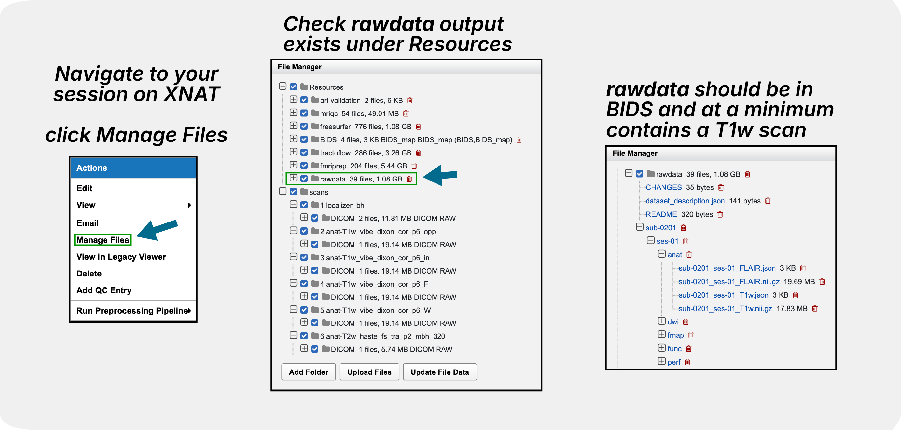

MRIQC
=====

This page provides information on running the MRIQC pipeline via XNAT.
We will explain **what MRIQC does**, show you **what you need to run MRIQC** and the exact steps to launch it, and help you understand some of the key **MRIQC outputs**.

What is MRIQC?
--------------

MRIQC (MRI Quality Control) is an automated processing pipeline designed to calculate quality metrics for structural and functional MRI data. It functions with minimal manual intervention and provides:

- **Automated Quality Assessment**: Extracts standardized image quality metrics (IQMs) from T1w, T2w, and BOLD data.
- **Visual Reports**: Generates interactive HTML reports that allow researchers to visually inspect individual scans and identify artifacts (e.g., motion, susceptibility distortion).
- **Group-Level Analysis**: Facilitates the comparison of quality metrics across the entire dataset to spot outliers.

For detailed information about the metrics and methods, visit the `official MRIQC documentation <https://mriqc.readthedocs.io/en/latest/>`_.

.. raw:: html

    
    

What You Need Before Running
----------------------------
Before running MRIQC, you need to run :doc:`dcm2bids`, which will convert the raw data to BIDS format and output in the ``rawdata`` directory under ``Resources``.

.. note::
   The pipeline requires a valid BIDS structure. Ensure that your scans are correctly named and organized by ``dcm2bids``.

.. raw:: html

    
    

How to Launch the Pipeline
--------------------------
.. note::
   For step-by-step instructions on running any pipeline, see :doc:`../working_with_xnat/running_pipelines`. To enable pipelines for your project, see :doc:`../working_with_xnat/enabling_pipelines`. For running pipelines across multiple subjects in parallel, see :doc:`../working_with_xnat/parallel_processing`.

Navigate to your **session** on XNAT, click **"Run Preprocessing Pipeline"**, select **"MRIQC"** from the pipeline dropdown, and then click **Review and Submit**.

The current implementation on Jubail HPC is configured with standard settings:

- **Version**: MRIQC v24.0.2
- **Resources**: 16 CPUs, 64 GB RAM (approx.), 4 hour time limit
- **Modalities**: Automatically processes T1w, T2w, BOLD, and DWI images found in the BIDS directory.

The underlying submission logic looks like the following:

.. code-block:: bash

   #SBATCH -n 1            # number of tasks
   #SBATCH -c 16           # number of cpus per task
   #SBATCH -o slurm-{workflow_id}.out
   #SBATCH -e slurm-{workflow_id}.err
   #SBATCH --time=04:00:00

   # Load singularity module
   module load singularity
   SINGULARITY_IMG=/scratch/mri/singularityimages/mriqc_24.0.2.sif

   # Create output directory
   mkdir -p "${OUTPUT_DIR}"

   singularity run --cleanenv \
       -B "${INPUT_DIR}":/data:ro \
       -B "${OUTPUT_DIR}":/out \
       -B "${WORKDIR}":/work \
       "${SINGULARITY_IMG}" \
       /data /out participant \
       --participant-label {sub_label} \
       -m T1w T2w bold dwi \
       --work-dir /work \
       --n_procs 16 \
       -v

.. raw:: html

    
    

Important Things to Pay Attention To
------------------------------------

**During Processing:**

- **Monitor job status** through XNAT pipeline interface
- **Be patient** - processing typically takes 30-60 minutes per subject, but can vary depending on the number of scans.

**After Completion:**

- **Review HTML reports** for valid visual quality and artifacts.
- **Check IQMs** for any statistical outliers.

.. raw:: html

    
    

Output Structure
----------------

MRIQC generates outputs in the ``Resources/mriqc`` directory. The structure follows the BIDS Derivatives specification.

.. parsed-literal::

    **<Resources>/**
      **mriqc/**
        dataset_description.json
        logs/
        **sub-9527/**
            **ses-01/**
                **anat/**
                    sub-9527_ses-01_T1w.json
                **func/**
                    sub-9527_ses-01_task-restingstate_dir-AP_run-01_bold.json
                    sub-9527_ses-01_task-restingstate_dir-AP_run-01_timeseries.json
                    sub-9527_ses-01_task-restingstate_dir-AP_run-01_timeseries.tsv
                    ...
        sub-9527_ses-01_T1w.html
        sub-9527_ses-01_task-restingstate_dir-AP_run-01_bold.html
        ...

**Key Output Files:**

- ``mriqc/sub-<label>_*_<modality>.html``: **Individual HTML Reports**. These are the most important files for visual inspection. They contain "carpet plots" for functional data, background noise assessments, and segmentation visualizations for structural data. Open these in a browser to check for motion spikes, ghosting, or wrong orientation.
- ``mriqc/sub-<label>/**/func/*_bold.json``: **Image Quality Metrics (IQMs)**. A JSON file containing calculated metrics like SNR (Signal-to-Noise Ratio), FD (Framewise Displacement), and others.
- ``mriqc/sub-<label>/**/func/*_timeseries.tsv``: **Timeseries Data**. Tab-separated values file containing frame-wise metrics for functional runs, useful for detailed motion analysis (e.g., standard DVARS, FD per volume).

.. raw:: html

    
    

Running the Group Level Analysis
--------------------------------

After processing individual subjects, you can run the **MRIQC Group Pipeline** to generate study-wide reports. This is useful for identifying outliers across your entire cohort.

**Prerequisites:**
You must have successfully run the participant-level MRIQC pipeline for your subjects.

**How to Launch:**
Navigate to your **Project Page** (not the session page). Under the **"Actions"** menu on the right, select **"Run Containers"** -> **"MRIQC Group on Jubail"**.

.. raw:: html

    

.. image:: ../_static/3.7.mriqc.group.launch.png
   :alt: MRIQC Group Launch
   :align: center
   :width: 900px

**Outputs:**
The group pipeline aggregates metrics from all processed subjects and produces group reports in the **Project Resources**. You can access them via the **"Manage Files"** or **"View Resources"** button on the project page.

.. raw:: html

    

.. image:: ../_static/3.7.mriqc.group.report.png
   :alt: MRIQC Group Report Example
   :align: center
   :width: 900px

.. raw:: html

    

.. parsed-literal::

    **<Project RESOURCES>/**
      **mriqc-group-jubail/**
         **mriqc/**
            dataset_description.json
            logs/
            group_T1w.html
            group_T1w.tsv
            group_bold.html
            group_bold.tsv
            ...

- **group_*.html**: Interactive HTML reports showing the distribution of quality metrics (e.g., SNR, CNR, Framewise Displacement) across all subjects. These reports allow you to easily identify outliers by hovering over the data points to see the subject ID.
- **group_*.tsv**: Tab-separated files containing the raw metrics for all subjects. These are ideal for importing into statistical software (like R, Python/Pandas, or Excel) to perform custom analyses or to exclude participants based on specific quality criteria (e.g., "exclude all subjects with mean FD > 0.5mm").

.. raw:: html

    
    

Troubleshooting
---------------

- **Job Timeout**: If the job fails with a timeout (exceeding 4 hours), it might be due to an unusually large dataset or high-resolution images. Please contact us for support.
- **Missing Outputs**: If HTML reports are missing, check the ``logs`` directory (accessible via XNAT or the file system) to see if the pipeline crashed due to BIDS errors.

.. raw:: html

    
    

Next Steps
----------
1. Use :doc:`../data_download/browser` to access results.
2. If quality is good, proceed to preprocessing (e.g., :doc:`fmriprep`).

.. note::
   Currently, we are running **MRIQC v24.0.2**. We are working on making more versions available. If you have an urgent request for a specific version, please contact us.