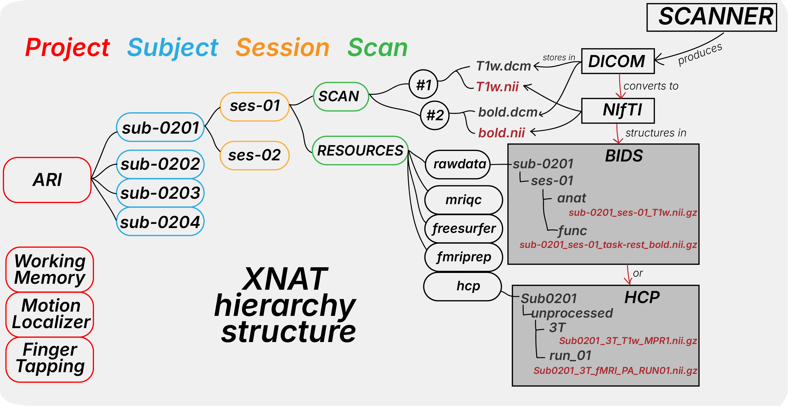

Understanding MRI Data File
===========================

This section explains the different MRI data formats used in research and how they relate to each other. 
Understanding these formats will greatly help you working with XNAT, so we start here.

Data Format Relationships
-------------------------

MRI data follows a specific conversion pathway that determines which analysis pipelines you can use:

**Conversion Pathway:**

::

    DICOM Files          NIfTI Files              Organized Data
    (Raw Scanner)    →   (Analysis Ready)    →    (Pipeline Ready)
         │                     │                        │
    • Multiple files      • Single file/volume       ├─ BIDS Format
    • Rich metadata       • Simplified header        │  └─ fMRIPrep, QSIPrep
    • Patient info        • Standard orientation     │     MRIQC, TractoFlow
    • Complex structure   • Analysis tool support    │
                                                     └─ HCP Format
                                                        └─ HCP Pipeline

**Available Conversion Tools:**

- :doc:`../processing_pipelines/dcm2niix` - DICOM to NIfTI
- :doc:`../processing_pipelines/dcm2bids` - DICOM to BIDS
- :doc:`../processing_pipelines/dcm2hcp` - DICOM to HCP (under development)

How does this work with XNAT?
-----------------------------

Format Overview
---------------

**DICOM (Digital Imaging and Communications in Medicine)**
- Raw data straight from the MRI scanner
- Contains rich metadata and multiple files per scan
- Industry standard but complex to work with
- Must be converted for analysis

**NIfTI (Neuroimaging Informatics Technology Initiative)**
- Simplified MRI data format
- Single file per volume with header information
- Widely supported by analysis tools
- Intermediate format for further organization

**BIDS (Brain Imaging Data Structure)**
- Standardized way to organize MRI data
- Includes consistent naming conventions and metadata
- Required for many neuroimaging pipelines such as fMRIPrep, QSIPrep, MRIQC, TractoFlow, etc.

**HCP (Human Connectome Project)**
- A special format used by HCP pipelines

Choosing Your Workflow
----------------------

**Common Workflows:**

- **Standard Analysis:** DICOM → BIDS → fMRIPrep/QSIPrep → Analysis
- **Quality Control:** DICOM → BIDS → MRIQC → Review
- **Connectome Analysis:** DICOM → HCP input → HCP Pipeline → Analysis
- **Tractography:** DICOM → BIDS → TractoFlow → Analysis

Next Steps
----------

- Learn about :doc:`bids` 