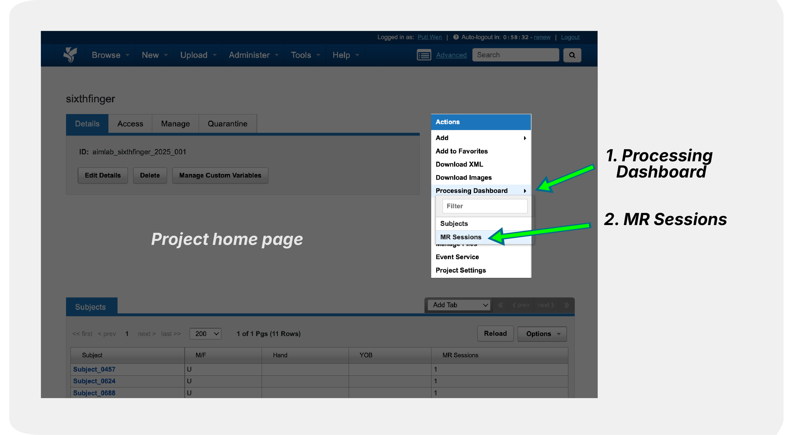
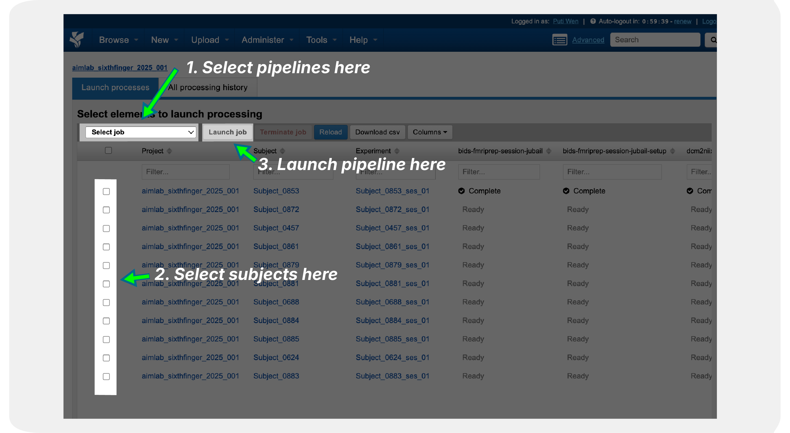

Running Pipelines Across Multiple Subjects
==========================================

This page explains how to run processing pipelines across multiple subjects in parallel on XNAT. 

Prerequisites
-------------

**Before Running Parallel Jobs:**

1. **Pipeline Access**: Ensure pipelines are enabled for your project (see :doc:`enabling_pipelines`)
2. **Data Preparation**: All subjects should have required input data

Step-by-Step Instructions
-------------------------

**1. Navigate to Project Level**

Navigate to your project in XNAT and look for the pipeline options at the project level.

**2. Configure Parallel Processing**

Select the pipelines and subjects you want to process and launch the pipeline.

Related Documentation
--------------------

- :doc:`enabling_pipelines` - Setting up pipeline access
- :doc:`../processing_pipelines/overview` - Available pipelines
- :doc:`../support/troubleshooting` - Common issues and solutions

Getting Help
------------

**For Technical Support:**
- Contact XNAT support with specific error messages
- Provide job logs and configuration details
