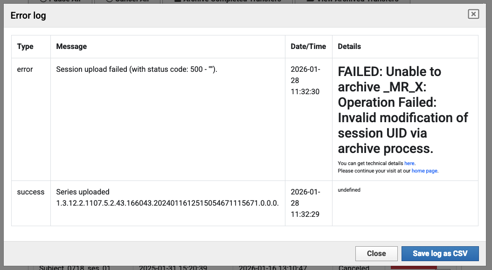
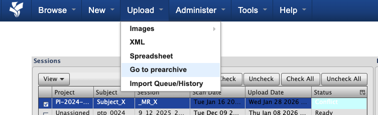
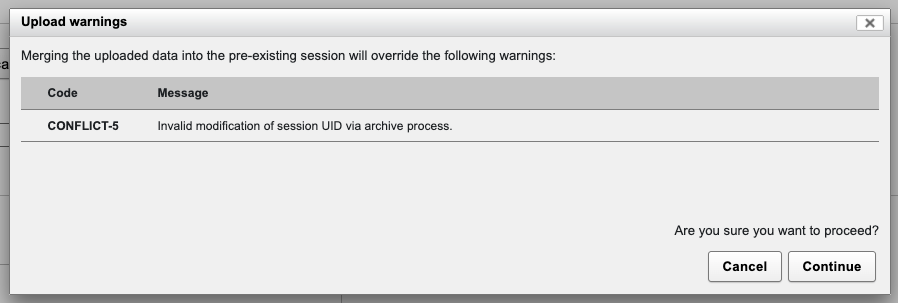
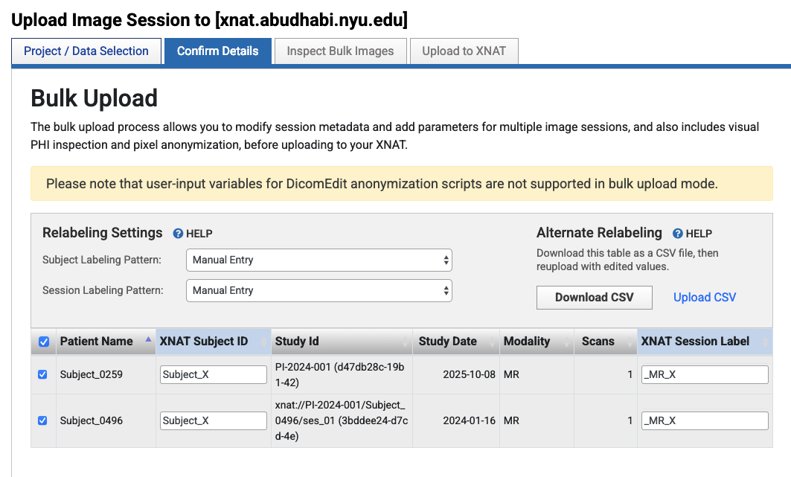
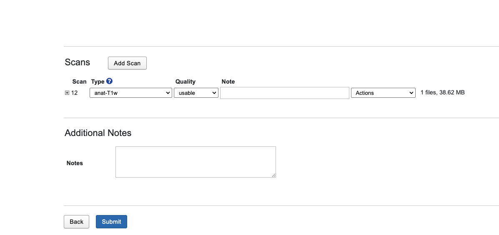

Resolving UID Errors During Archiving
======================================

This guide explains how to identify and resolve UID (Unique Identifier) errors that occur during the archiving process, particularly when attempting to merge data from different sessions with conflicting UIDs into a single XNAT session.

Overview
--------

UID errors during archiving typically occur when:

- **Merging different sessions**: Attempting to combine data from multiple DICOM sessions (each with unique UIDs) into a single XNAT session
- **Transferring data**: Moving data between projects where session labels are manually mapped to match existing sessions
- **Bulk uploads**: Uploading multiple sessions simultaneously where some sessions are incorrectly mapped to the same target session

When XNAT detects that incoming data contains UIDs that conflict with an existing session's UIDs, it prevents the archiving operation to maintain data integrity. These errors are most commonly encountered during the archiving step, after data has been uploaded to the Prearchive.

Understanding DICOM UIDs
--------------------------

DICOM (Digital Imaging and Communications in Medicine) files use a hierarchical system of Unique Identifiers (UIDs) to catalog and organize imaging data. Understanding this system is crucial for understanding why UID conflicts occur.

**How DICOM Databases Catalog Files**

DICOM files are organized using several types of UIDs:

- **Study Instance UID**: Uniquely identifies a study (imaging session) from a scanner
- **Series Instance UID**: Uniquely identifies each scan series within a study
- **SOP Instance UID**: Uniquely identifies individual DICOM files

These UIDs are embedded in every DICOM file's header and serve as the primary mechanism for organizing and tracking imaging data in DICOM-compliant systems.

**Why UIDs Are Critical for Data Integrity**

UIDs ensure that:

- Each imaging study can be uniquely identified across different systems
- Data from different scanners or sessions can be distinguished
- Files can be correctly associated with their parent studies and series
- Data integrity is maintained when files are moved or copied between systems

**What Happens When Different UIDs Are Merged**

When you attempt to merge data from two different DICOM sessions (each with unique Study Instance UIDs) into a single XNAT session, you're essentially trying to combine:

- Data from Session A (with Study Instance UID: ``1.2.3.4.5...``)
- Data from Session B (with Study Instance UID: ``6.7.8.9.10...``)

Into one XNAT session. This creates a conflict because:

1. The DICOM files from Session A contain references to their original Study Instance UID
2. The DICOM files from Session B contain references to a different Study Instance UID
3. XNAT cannot modify these UIDs during archiving (as they are fundamental to DICOM data integrity)
4. Having two different Study Instance UIDs in one session violates DICOM standards and XNAT's data model

**Why XNAT Detects and Prevents Invalid UID Modifications**

XNAT's archiving process validates that:

- All DICOM files in a session belong to the same study (same Study Instance UID)
- UIDs are not modified inappropriately during the archiving process
- Data integrity is maintained according to DICOM standards

If XNAT detects that you're attempting to archive data with conflicting UIDs into an existing session, it will prevent the operation and flag it as a conflict.

Understanding the Prearchive
----------------------------

The **Prearchive** is XNAT's staging area where uploaded data is held temporarily before being committed to the permanent Archive. It allows you to review, edit labels, and resolve conflicts before data becomes permanent.

When data is uploaded to XNAT, it first lands in the Prearchive where you can:

- Review sessions and identify conflicts (including UID conflicts)
- Edit Subject IDs and Session Labels to resolve issues
- Delete incorrect data before archiving
- Select sessions and proceed with archiving once conflicts are resolved

Sessions in the Prearchive display status indicators such as "Ready", "Conflict", or "Error" to help you identify issues that need attention before archiving.

For more detailed information about the Prearchive, including status indicators and workflow, see :doc:`prearchive`.

Understanding the Error
-----------------------

When XNAT detects a UID discrepancy during the archiving process, it prevents the operation and reports an error. Understanding how these errors work helps you resolve them effectively.

**UID Discrepancy Errors When Merging Different Sessions**

UID errors occur when XNAT detects that:

- Incoming data contains DICOM files with Study Instance UIDs that differ from an existing session's UIDs
- You're attempting to merge data from multiple distinct DICOM studies into one XNAT session
- The archiving process would violate DICOM standards by combining incompatible UIDs

These errors are not limited to a single error code—XNAT may report various error messages depending on the specific conflict detected.

**How XNAT Detects Conflicts**

During the archiving process, XNAT:

1. **Validates UID consistency**: Checks that all DICOM files in a session reference the same Study Instance UID
2. **Compares with existing sessions**: If merging into an existing session, compares incoming UIDs with the session's existing UIDs
3. **Flags conflicts**: When UID mismatches are detected, flags the session with a "Conflict" status in the Prearchive
4. **Prevents archiving**: Blocks the archiving operation until the conflict is resolved

**Common Error Messages Related to UID Modifications**

Error messages you may encounter include:

- "Invalid modification of session UID via archive process"
- "UID conflict detected during archiving"
- "Cannot merge sessions with different Study Instance UIDs"
- "Session upload failed" with UID-related details in the error log

These messages all indicate that XNAT has detected a UID conflict that must be resolved before archiving can proceed.

**Why These Errors Occur During the Archiving Process**

UID errors typically occur during archiving (not during upload) because:

- **Upload stage**: Data is accepted into the Prearchive without strict UID validation
- **Archiving stage**: XNAT performs comprehensive validation, including UID consistency checks
- **Conflict detection**: The archiving process is when XNAT compares incoming data with existing sessions and detects conflicts

This design allows you to upload data and review it in the Prearchive, then resolve conflicts before committing to the Archive.

Identifying the Problem
-----------------------

The most reliable way to identify UID conflicts is through the error log, which shows detailed information about what went wrong:

--------------------------------

The error log shows "Session upload failed" with details indicating "Invalid modification of session UID via archive process." This confirms that a UID conflict prevented the archiving operation.

**Prearchive Status Showing "Conflict"**

When you navigate to the Prearchive, sessions with UID conflicts will show a "Conflict" status:

--------------------------------

In this example, you can see sessions in the Prearchive with "Conflict" status, indicating that XNAT has detected an issue (such as a UID conflict) that must be resolved before archiving.

**Warning Dialogs During Archiving**

When attempting to archive a session with a UID conflict, you may see warning dialogs:

--------------------------------

This dialog warns that merging the uploaded data will override warnings, including UID-related conflicts. The message indicates "Invalid modification of session UID via archive process," which is a clear indicator of a UID conflict.

Step-by-Step Resolution
-----------------------

Follow these steps to resolve UID conflicts when archiving:

**Step 1: Navigate to Prearchive and Identify Conflict Status**

1. Log into XNAT and navigate to **Upload** > **Go to prearchive** from the top navigation menu
2. Review the Sessions table to identify sessions with "Conflict" status
3. Note which sessions are in conflict and what Subject/Session labels they're using

--------------------------------

In this example, you can see sessions in the Prearchive with "Conflict" status. This indicates that XNAT has detected a UID conflict that needs resolution before archiving can proceed.

**Step 2: Understanding the Source of the Conflict**

The conflict occurs when you attempt to map two separate DICOM sessions (each with unique Study Instance UIDs) to the same XNAT session label. This typically happens in Desktop Client's "Confirm Details" screen during bulk upload:

--------------------------------

In this example, you can see that two distinct sessions are being mapped to the same XNAT Session Label:

- **Session 1**: Patient Name "Subject_0259", Study ID "PI-2024-001 (d47db28c-19b1-42)", mapped to Session Label "_MR_X"
- **Session 2**: Patient Name "Subject_0496", Study ID "xnat://PI-2024-001/Subject_0496/ses_01 (3bddee24-d7cd-4e)", also mapped to Session Label "_MR_X"

These are two different DICOM studies with different Study Instance UIDs, but they're both being assigned to the same XNAT session label. This is the source of the UID conflict that causes the error.

**Step 3: Select Conflicted Session and Review**

1. From the Prearchive, select the conflicted session (check the checkbox)
2. Click **"Review and Archive"** to proceed with reviewing the session details
3. This will take you to a screen where you can review scans and force the merge if needed

**Step 4: Force the Merge (If Required)**

If you need to force the merge despite the UID conflict (for example, when sessions were broken down but need to be combined, or files from another study need to be together under one session):

1. Review the scan details in the session review screen
2. Verify that you want to proceed with merging despite the UID conflict
3. Click **"Submit"** to force the merge and proceed with archiving

--------------------------------

This screen allows you to review individual scans and their metadata. The "Submit" button will force the merge despite the UID conflict warning.

.. warning::
   **Forcing Merges with UID Conflicts**
   
   Forcing a merge when UID conflicts exist should only be done when you understand the implications. This typically occurs when:
   
   - Sessions were incorrectly broken down and need to be recombined
   - Files from another study need to be together under one session for analysis purposes
   - You have a specific reason to combine data with different Study Instance UIDs
   
   Be aware that this may affect data integrity and compliance with DICOM standards.

**Alternative: Assign Unique Session Labels**

If you don't need to merge the sessions, you can resolve the conflict by assigning unique session labels:

1. In Desktop Client "Confirm Details" screen or Prearchive, locate the "XNAT Session Label" field for each session
2. Ensure each distinct DICOM session (with different Study Instance UIDs) has a unique XNAT Session Label
3. For example:
   - Session 1 (Subject_0259): Change Session Label to "_MR_X_0259" or "Subject_0259_session01"
   - Session 2 (Subject_0496): Change Session Label to "_MR_X_0496" or "Subject_0496_session01"
4. Verify that each session now has a unique label that doesn't conflict with existing sessions

After assigning unique labels, the UID conflict will be resolved, and each session can be archived separately.

See Also
--------

**Related Documentation**

- :doc:`prearchive` - Detailed information about the Prearchive system
- :doc:`uploading` - Detailed upload procedures and methods
- :doc:`transferring_data` - Guide for transferring data between projects
- :doc:`install_desktop_client` - Desktop Client installation guide
- :doc:`access` - Project access and permissions information

**Official XNAT Documentation**

- `XNAT Wiki: Archiving Data <https://wiki.xnat.org/display/XNAT18/Archiving+Data>`_ - Official documentation on the archiving process
- `XNAT Wiki: Prearchive <https://wiki.xnat.org/display/XNAT18/Prearchive>`_ - Information about the Prearchive system

**Support**

- Contact XNAT administrators at admin.nyuad.xnat@nyu.edu for assistance with persistent UID conflicts or complex scenarios
