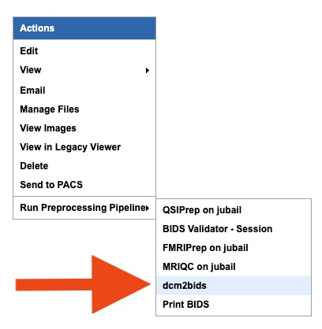

BIDS Usage on XNAT
==================

This page outlines how the Brain Imaging Data Structure (BIDS) is used by XNAT. 

   
Running dcm2bids
-------------------
* On the session page, navigate to Actions → Run preprocessing pipeline, and run dcm2bids

* The "dcm2bids" pipeline will perform BIDS conversion *and* BIDS validation

Viewing BIDS Output
-------------------
* To view BIDS output, navigate to Manage Files → resources → BIDS, and expand to view the contents
* To view the validator output,  scroll down to the “Historyˮ window and click on the StdOut.log associated with the "bids-validator - session" activity:

Adding & Modifying a BIDS config.json file
------------------------------------------

The following instructions go through the steps needed to add and download a BIDS config.json file to a project. The config file is the responsibility of the project owner. If you do not have a BIDS config.json file, you can find a sample here:

:download:`Download config.json <../_static/config.json>`

New Project
^^^^^^^^^^^
1. XNAT requires a folder to upload your config files to. This only needs to be done once when a new project is created on XNAT

   .. image:: ../_static/config_1.png

2. Navigate to your project page, and select "Manage Files"

   .. image:: ../_static/config_2.png

3. Click on "Add Folder"

   .. image:: ../_static/config_3.png

4. Select "resources" from the "Level" drop-down menu

   .. image:: ../_static/config_4.png

5. Name the folder and click "Create". This will be the location of your BIDS config.json file

   .. image:: ../_static/config_5.png

Uploading a config.json file
^^^^^^^^^^^^^^^^^^^^^^^^^^^^
1. Click on "Upload Files"

   .. image:: ../_static/config_6.png

2. Select "resources" from the "Level" drop-down menu, and then the folder you wish to upload the config file to

   .. image:: ../_static/config_7.png

3. Click on "Choose File", select you config file, and then hit "Upload"

   .. image:: ../_static/config_8.png

Your config file has now been uploaded! dcm2bids will now use your config file to perform BIDS conversions for this project.

* If you want to download the config file on XNAT, simply click on the config.json and the download will begin
* To modify the config.json, you will need to delete the old config file and upload a new, one using the instructions above

