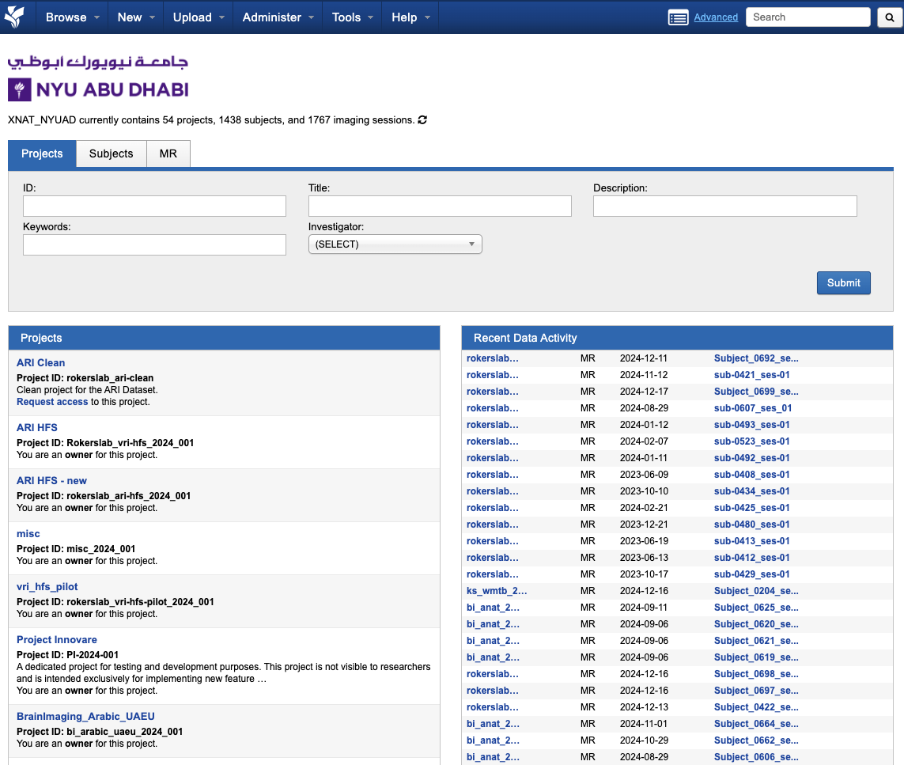
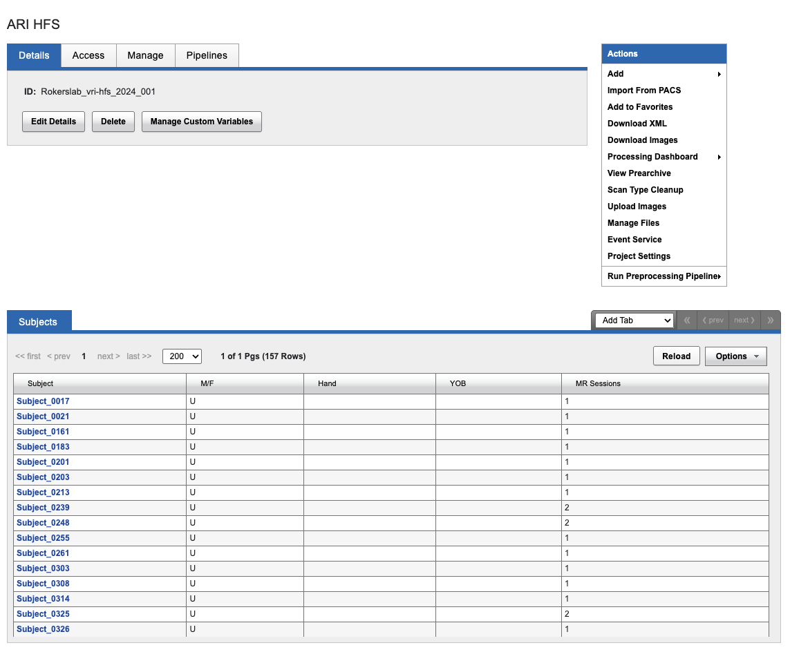

Navigating XNAT
===============

XNAT contains multiple projects that contain:
   * Raw data (e.g. DICOMs)
   * Preprocessed data 

|
Raw data is uploaded into the appropriate scan session (arranged by scan date), and placed under a unique subject identifier (i.e. sub-0100). Subjects can be found under different projects, as shown in the screenshot below:

|
Project
-------
* The home page displays all projects you have access to
* If you can’t find the right project, kindly request access Soumen Mohanty (sm8966@nyu.edu)
* Select the project to view the subject-level data
* You can add a tab (MR Session) to organize data based on the scan date

Subject
-------
* If your subject has multiple sessions, they will appear on this page
* Session-specific data can be accessed by clicking on the MR Session tab on the middle bottom of the screen

Session
-------
* All raw scans, in DICOM format, will appear on this page
* A session is defined as a single scan session for a given subject at a given time
    
