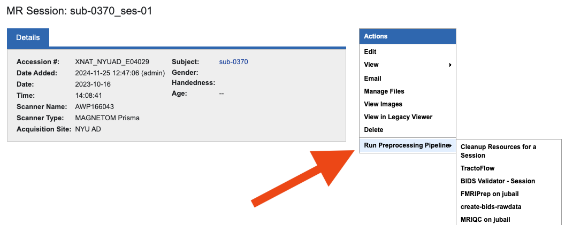
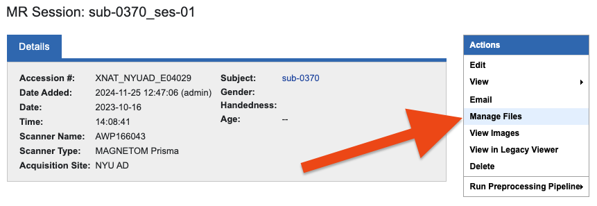
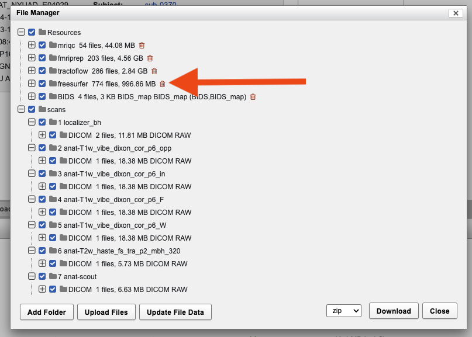
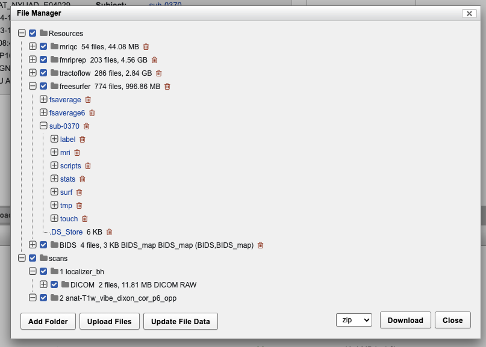

Running Preprocessing Pipelines on XNAT
=======================================

Running Pipelines On a Scan Session 
-----------------------------------------

The following instructions are for running pipelines at the session level.

* All pipelines are found under the "Run preprocessing pipeline" under the “Actionsˮ tab on the right side of the session page. Hovering over this button will show a dropdown menu of available pipelines 

* Pipelines that require more computing resources and time (i.e. fmriprep, tractoflow, etc.) are sent to the Jubail HPC for processing. Derivatives and log files are returned to XNAT. Pipelines can be run locally on XNAT nodes in case Jubail is down, **but these resources are limited**

Running Pipelines for a Project
-----------------------------------------

1. Navigate to your project's page, click on Actions → Processing Dashboard → MR Sessions

   .. image:: ../_static/pipe_proj_1.png
|
2. Select a pipeline to run

   .. image:: ../_static/pipe_proj_2.png
|
3. Select the subjects/sessions to be processed

   .. image:: ../_static/pipe_proj_3.png
|
4. Verify the details of your job and submit. This will run the selected pipeline on the selected sessions in parallel

   .. image:: ../_static/pipe_proj_4.png
|
5. To view log files, navigate to the "All Processing History" tab

   .. image:: ../_static/pipe_proj_5.png
|
6. Log files are viewed the same way as described in the session level 
   instructions: hover over the job, click the eye icon and select "View StdOut.log"

   .. image:: ../_static/pipe_proj_6.png

Derivatives
-----------
Manage Files is the file manager for the raw and and derivative imaging files. You
can find DICOMS and BIDS data under “scansˮ, and derivatives under
“resourcesˮ. To view pipeline output:

1. Navigate to Manage Files → resources → Pipeline

|
2. Click on the pipeline name to view its output. In this case, we will look at Freesurfer

|
3. Expand the directory to explore the output contents. Selecting a file will download it

|

Viewing BIDS
------------
* To view BIDS output, navigate to "Manage Files" → "BIDS" → BIDS_map.json. A sample BIDS_map.json for an ARI subject would look like:

::

   {
       "sub-0370/ses-01": [],
       "sub-0370/ses-01/dwi": [
           "sub-0370_ses-01_dir-AP_dwi.bvec",
           "sub-0370_ses-01_dir-AP_dwi.json",
           "sub-0370_ses-01_dir-AP_dwi.bval",
           "sub-0370_ses-01_dir-AP_dwi.nii.gz"
       ],
       "sub-0370/ses-01/anat": [
           "sub-0370_ses-01_T1w.json",
           "sub-0370_ses-01_FLAIR.json",
           "sub-0370_ses-01_FLAIR.nii.gz",
           "sub-0370_ses-01_T1w.nii.gz"
       ],
       "sub-0370/ses-01/fmap": [
           "sub-0370_ses-01_dir-PA_run-01_epi.json",
           "sub-0370_ses-01_dir-PA_run-02_epi.bvec",
           "sub-0370_ses-01_dir-AP_epi.nii.gz",
           "sub-0370_ses-01_dir-PA_run-02_epi.bval",
           "sub-0370_ses-01_dir-AP_epi.json",
           "sub-0370_ses-01_dir-PA_run-02_epi.json",
           "sub-0370_ses-01_dir-PA_run-02_epi.nii.gz",
           "sub-0370_ses-01_dir-PA_run-01_epi.nii.gz"
       ],
       "sub-0370/ses-01/perf": [
           "sub-0370_ses-01_m0scan.nii.gz",
           "sub-0370_ses-01_m0scan.json",
           "sub-0370_ses-01_asl.json",
           "sub-0370_ses-01_asl.nii.gz"
       ],
       "sub-0370/ses-01/func": [
           "sub-0370_ses-01_task-restingstate_dir-PA_run-02_bold.nii.gz",
           "sub-0370_ses-01_task-restingstate_dir-PA_run-02_sbref.nii.gz",
           "sub-0370_ses-01_task-restingstate_dir-AP_run-02_sbref.nii.gz",
           "sub-0370_ses-01_task-restingstate_dir-PA_run-01_bold.nii.gz",
           "sub-0370_ses-01_task-restingstate_dir-AP_run-02_bold.json",
           "sub-0370_ses-01_task-restingstate_dir-AP_run-02_sbref.json",
           "sub-0370_ses-01_task-restingstate_dir-PA_run-01_bold.json",
           "sub-0370_ses-01_task-restingstate_dir-AP_run-01_bold.nii.gz",
           "sub-0370_ses-01_task-restingstate_dir-PA_run-01_sbref.json",
           "sub-0370_ses-01_task-restingstate_dir-PA_run-02_sbref.json",
           "sub-0370_ses-01_task-restingstate_dir-PA_run-01_sbref.nii.gz",
           "sub-0370_ses-01_task-restingstate_dir-AP_run-01_sbref.json",
           "sub-0370_ses-01_task-restingstate_dir-AP_run-02_bold.nii.gz",
           "sub-0370_ses-01_task-restingstate_dir-AP_run-01_bold.json",
           "sub-0370_ses-01_task-restingstate_dir-PA_run-02_bold.json",
           "sub-0370_ses-01_task-restingstate_dir-AP_run-01_sbref.nii.gz"
       ]
   }

