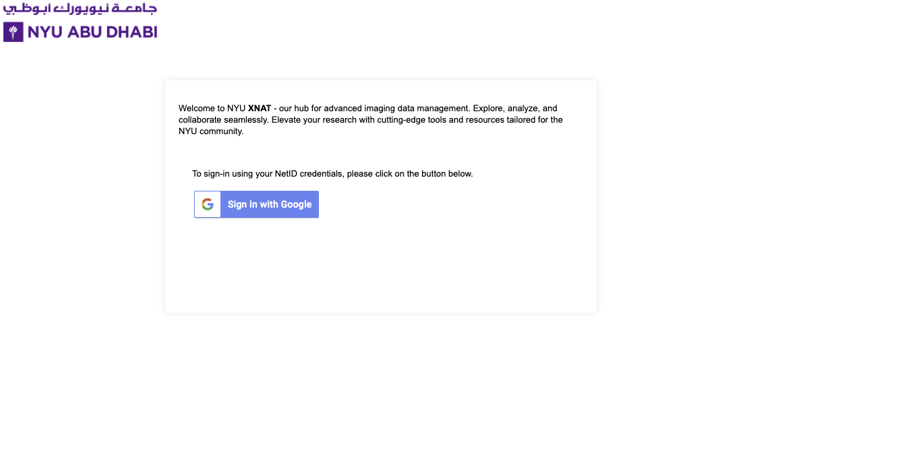
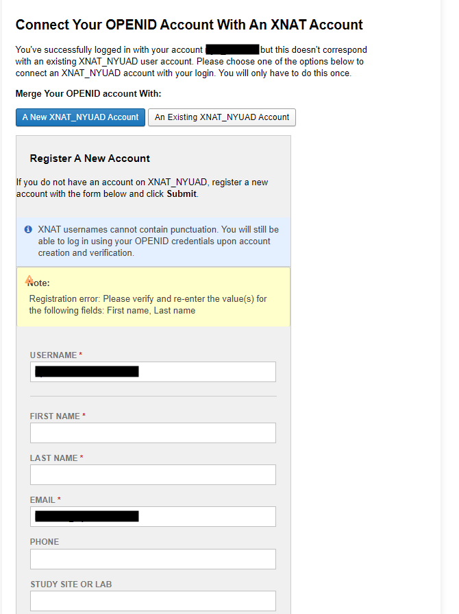

Accessing XNAT
==============

Creating An XNAT Account (First Time Users)
-------------------------------------------
To access the NYUAD XNAT platform:

1. Navigate to https://xnat.abudhabi.nyu.edu
2. Click on "Sign in with Google"

3. Input your first and last name in the required fields

4. Scroll to the bottom of the page and click on "Register"
5. An authorization request will be sent to the site administrator, Soumen Mohanty (soumen.mohanty@nyu.edu), for approval
6. Once your account is approved, you will need to request access to specific projects. Email Soumen with the project names to obtain access

You can now sign in using step 2: "Sign in with Google"