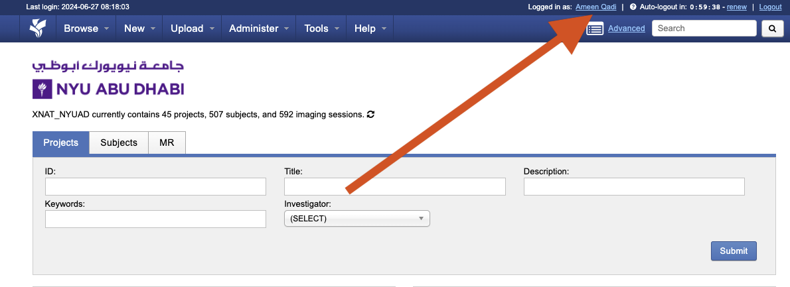
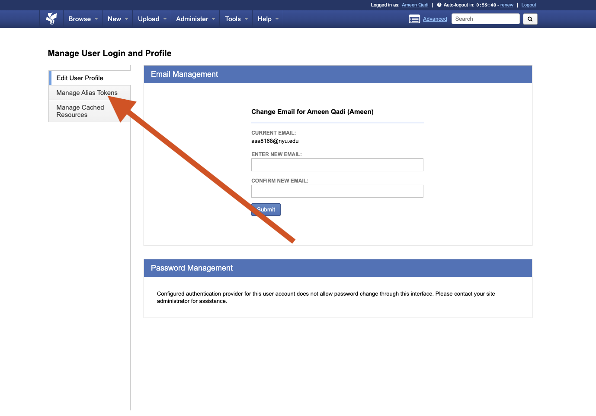
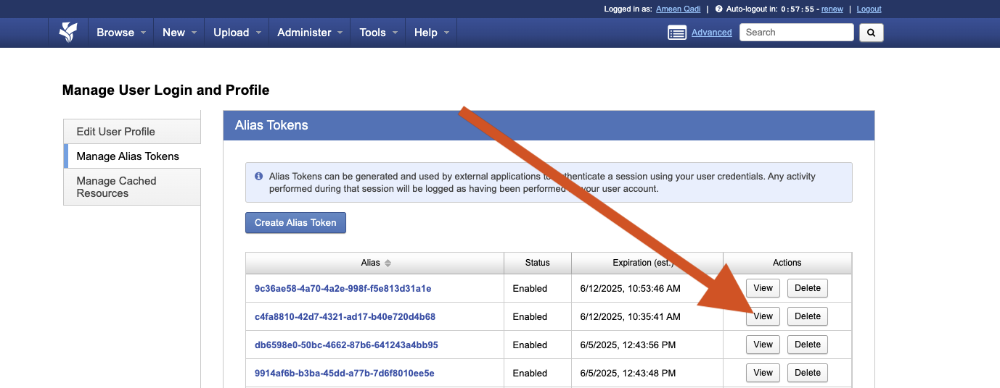

Configuring and Using the XNAT CLI
==================================

Downloading data stored on XNAT can be done using a custom-made command line interface developed by Amr Shadid and Soumen Mohanty. This option allows you to download DICOM, NIfTI BIDS data directly from XNAT. This functionality requires the usage of a conda environment:

Setup
-----

1. Create a Conda Environment 
^^^^^^^^^^^^^^^^^^^^^^^^^^^^^
.. raw:: html

   Create a <a href="https://conda.io/projects/conda/en/latest/user-guide/install/index.html" target="_blank">conda</a> environment to install the specific python version and dependencies for the script, and activate it.

.. code-block:: bash 

      cd ~
      conda create --name myenv python=3.9
      conda activate myenv 

2. Step 2: Download the XNAT CLI tool using pip 
^^^^^^^^^^^^^^^^^^^^^^^^^^^^^^^^^^^^^^^^^^^^^^^

.. code-block:: bash 

      pip install xnat-cli-tool

3. Generate XNAT alias (This only needs to be done once)
^^^^^^^^^^^^^^^^^^^^^^^^^^^^^^^^^^^^^^^^^^^^^^^^^^^^^^^^

.. raw:: html

   Log onto <a href="https://xnat.abudhabi.nyu.edu/" target="_blank">XNAT</a>, click on your name after “Logged in as:”. This will take you to the *Manage User Login and Profile* page

Click on the “Manage Alias Tokens” tab in the left side of the page

|
Click on “View” on any unexpired token. A new window will pop up.
   

Copy and paste the "Alias" and the "Secret" fields into the command in the next step. They serve as a username and password for the script to access XNAT using your account

.. image:: ../_static/alias_4.png

Run the following command in the terminal: 

.. code-block:: bash 

      xt login <alias> <secret>

Hit **Enter** to accept the default. If successful, you should see something like: 

.. code-block:: bash 

      This is a Beta version of the XNAT CLI Tool. For assistance, please contact: nyuad.xnat@nyu.edu
      Config file not found. A new one will be created with default values.
      Enter the XNAT server URL [http://10.230.12.52]:
      Logged in successfully with username: 22967446-acb9-4324-9ddc-9aa982767b2a

This will create an alias that logs you into XNAT every time you download data using this functionality, which can be found in ~/.config/xnat_cli/config.json. This step will need to be repeated when the token expires (Step 3, screenshot 3).

Downloading Your Data
---------------------

After installation, use the following command to download your data:

.. code-block:: bash 

      xt $DOWNLOAD_OPTION -s $SUBJECT_ID -p $PROJECT_ID -o $OUTPUT_PATH

The variables correspond to the following:

$DOWNLOAD_OPTION: download_dicom, download_bids

-s $SUBJECT_ID: subject ID

-p $PROJECT_ID: project ID

-o $OUTPUT_PATH: download location

To find the project and subject IDs, navigate to the project page on XNAT:

     .. image:: ../_static/proj_id.png

Downloading DICOM data for one subject
^^^^^^^^^^^^^^^^^^^^^^^^^^^^^^^^^^^^^^
To download a subject's DICOM data, include the download_dicom option, subject ID, and project ID, i.e.:

.. code-block:: bash 

      xt download_dicom -s Subject_0017 -p BrainImagingCore_anat_2024_001 -o ~/Downloads/

Downloading BIDS data for one subject
^^^^^^^^^^^^^^^^^^^^^^^^^^^^^^^^^^^^^
To download a subject's BIDS data, include the download_bids option, subject ID, and project ID, i.e.:

.. code-block:: bash 

      xt download_bids -s Subject_0017 -p BrainImagingCore_anat_2024_001 -o ~/Downloads/

**Note: This only works if the subject's data has been converted to BIDS first**

Downloading a project
^^^^^^^^^^^^^^^^^^^^^
To download all the data in a project, include only the project ID, i.e.:

.. code-block:: bash 

      xt download_bids -p BrainImagingCore_anat_2024_001 -o ~/Downloads/

Downloading a subject’s data from all projects
^^^^^^^^^^^^^^^^^^^^^^^^^^^^^^^^^^^^^^^^^^^^^^

To download a subject’s data from every project it is located in, include only the subject ID, i.e.:

.. code-block:: bash 

      xt download_bids -s Subject_0017 -o ~/Downloads/

